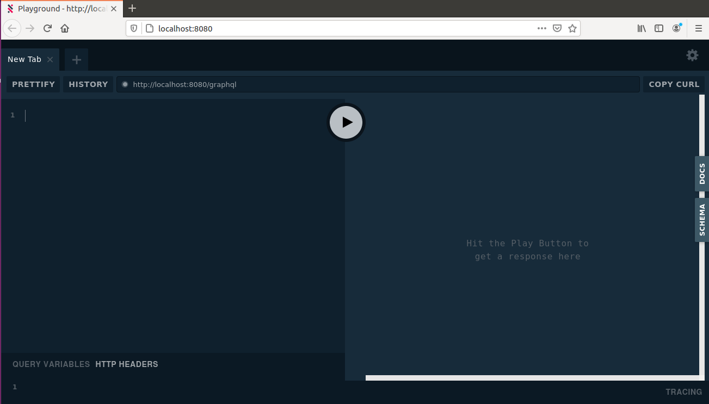

# Navy Digital Data Platform API Mocking Tool

## What is the Navy Digital Data Platform API Mocking Tool?
The Navy Digital Data Platform API Mocking Tool is a Navy Digital SDK Tool available to all App Teams and Developers. Its purpose is to assist the rapid development of Front-End Apps and Features through delivering Back-End Data Platform Mocking capabilities while remaining lightweight and easy to use.

The tool is developed with Front-End App Developers in mind and as such is built using Javascript, as opposed to using more back-end heavy languages. The tool is provided with a JSON data file, GraphQL Schema, and GraphQL Resolvers which are all editable by users to deliver a flexible Mocked Back-End. The back-end server makes use of [Apollo GraphQL Server](https://www.apollographql.com/docs/apollo-server/) which has great documentation on how to experiment with parts of this tool!


## Quick Start Guide
Follow the below process to get the API Mocking Tool running. More in depth instructions are found below should you need them.

  1. Install Node JS Version 12 or higher
  2. Clone this Repo from GitHub
  3. run `npm install` within the cloned repo to install all required dependencies
  4. run `npm start` within the cloned repo to run the tool
  5. For the GraphQL Playground copy and paste `http://localhost:8080/` into your browser
  6. Send GraphL Queries to `http://localhost:8080/graphql`
  7. Experiment and change your App Generated Data and Schema as you wish


## Full Start Guide
The following section discusses at reasonable depth each stage required to get the API Mocking Tool to work for you.


### Node JS Installation
Navy Digital Services currently use the latest LTS version of NodeJS, which at the time of writing is NodeJS v12.18.3. In your IDE of choice we recommend you follow their documentation to install or upgrade to this version should you wish to edit any code.


### Getting the code from this repo
This Repo will remain the most up to date and supported version of the publicly available Navy Digital Data Platform API Mocking Tool. With that in mind, for development uses it is advised that you clone this repo local to where you wish to develop your tools, such that you have freedom to experiment as you wish.


### Installing dependencies
The Navy Digital Data Platform API Mocking Tool uses a variety of packages and has dependencies that need to be managed for use. This tool uses NPM to manage these.

To install all the required dependencies, open a terminal in your local project directory as created above. Then run `npm install`, NPM will then resolve all the dependencies dictated within the `<yourLocalDir>/node_modules` directory.

You will notice that you will get some `npm WARN` logs due to optional dependencies. These are indeed optional and are just warnings, not errors. It does not impact the functioning of the tool. If you don't like warnings in your console, just run `npm install --silent` instead.


### Starting the Navy Digital Data Platform API Mocking Tool
The server can be run in one of two modes. The best way to run the server is to open a terminal in the project directory and enter:

```
npm start
```

This will start the server running on the default port, 8080. If you need to use an alternative port you can set an environment variable named `PORT` to change this, as shown below. Remember that queries will also have to be directed to this Port and not the default 8080.
```
PORT=9000 npm start
```

When the server starts it'll show a brief message to let you know. Every time the server gets a query it will output this to the console.


### Using the GraphQL Playground GUI
The Navy Digital Data Platform API Mocking Tool uses the `GraphQL Playground`. This gives users the ability to utilise the Playground UI to explore their schema and available data.

Once you have started the Navy Digital Data Platform API Mocking Tool you can open your browser and go to: `http://localhost:8080/` to get to the Playground UI.

This will present the GraphQL Playground as seen below:



From here, you can explore the available schema using the `SCHEMA` and `DOCS` tabs found on the right side of the UI and use them to help create new queries. Two example queries are shown below, you can cut and paste this to try it out within the Query Window on the left.

```
query mockQueryExample {
  dataSources(dataType: MockerType) {
    ... on MockedBackEndDataSource{
      yourMockedDataset{
        mockAttribute01
        mockAttribute02
        mockAttribute03
      }
    }
  }
}

query mockQueryExampleWithFilter {
  dataSources(dataType: MockerType) {
    ... on MockedBackEndDataSource {
      yourMockedDataset(mockAttribute01: "MockID: 010A") {
        mockAttribute01
        mockAttribute02
        mockAttribute03
      }
    }
  }
}
```

## Querying the Navy Digital Data Platform API Mocking Tool using curl
The Playground UI is very useful for data and schema exploration, however, ultimately this needs to get to your app. For this you can use curl commands or your latest App querying method.

You can enter a curl command, such as the one shown below, within a new terminal and it will return the data in the same way as you would receive from the GraphQL Playground shown earlier.

To try the below, just copy and paste it into a terminal.

```
curl 'http://localhost:8080/graphql' \
-H 'Content-Type: application/json' \
--data-binary '{"query":"query mockQueryExample {dataSources(dataType: MockerType) {... on MockedBackEndDataSource {yourMockedDataset{ mockAttribute01\n mockAttribute02\n mockAttribute03\n }}}}","operationName":"mockQueryExample"}'
```

## How does it work?

The server is built using a minimal implementation of [Apollo GraphQL Server](https://www.apollographql.com/docs/apollo-server/). 

Apollo is a lightweight GraphQL server framework written in Javascript and runs using NodeJS. All code in the project is written in JS and JSON.

The server loads the schema from the `src/graphql/schema.graphql` file and has a number of resolvers defined in the `src/graphql/Query`, `src/graphql/Type` and `src/graphql/Mutation` folders.

In place of a back-end database the Navy Digital Data Platform API Mocking Tool uses fixed data located in `data/ndp.json`. This is a simple JSON file that can be changed easily using an IDE. The top level `Query` resolver simply loads the JSON data file, while the `Type` resolvers deliver functionality to filter and shape the data requested.

For more in-depth explanations on these we advise referencing the Apollo GraphQL documentation which is very comprehensive.

An example of a `MockedBackEndDataSource` resolver that shapes data based upon a filter criteria is shown below. Similar ones can be found within the `src/graphql/Type` folder.

```
const MockedBackEndDataSource = {

  // Filter yourMockedDataset based upon mockAttribute01.
  yourMockedDataset: (parent, { mockAttribute01 }) => {
    const result = mockAttribute01
      ? parent.yourMockedDataset.filter((item) => item.mockAttribute01 === mockAttribute01)
      : parent.yourMockedDataset

    return result
  },
}

module.exports = MockedBackEndDataSource

```

If you only require a simple return of your JSON data, with no shaping or filtering, then no additional resolvers such as the above will be required.


## Working with the API Mocking Tool
Once you have Cloned the repo you may want to set up an IDE of your choice to read the data or create development changes. Below covers how to work with the data files for changing data and schemas.


### How do I add or update the Schema and Data?
Before attempting to change the data or its schema, be sure to have a thorough look at the GraphQl documentation online. Specifically target pages around `GraphQL Schemas`, `TypeDefs`, and `Resolvers`, as these are the primary building blocks on which this tool is built upon.

Once you are ready to experiment with the tool, you'll find that the current working example will be set up well enough for you to have a play to better understand the tool, how it works, and therefore how you can tweak it for your needs. There are some general rules of thumb that are worth noting, as follows:

  1. The Schema and Data must match. So if the Schema contains a DataSource or similar, it must exist within the Data file with the same name and structure.
  2. All data and schema types require a resolver to be queryable.
  3. If you want to add filtering or shaping of your data - you will need to add additional resolvers that deliver that function for you.
  4. If in doubt take a closer look at the working examples file structure and its contents as this will be good enough for you to copy, paste, edit, and execute with ease.
